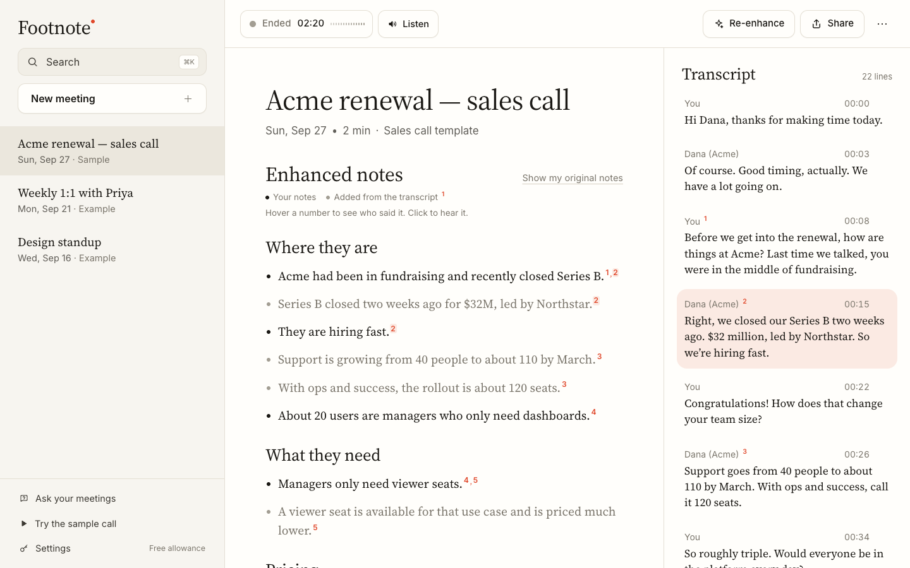

# Footnote

**Meeting notes with receipts.** Type rough notes during the call. Footnote turns them into clear notes where every line links to the exact moment it was said. It runs in your browser, keeps your meetings on your device, and uses your own OpenAI key. $59 once instead of $14 a month.



<!-- Demo GIF goes here: docs/demo.gif (sample call -> Enhance -> hover a footnote -> click to hear it) -->

**Try it in ten seconds:** open the demo and press **Try a sample meeting**. A staged two-minute renewal call plays, the transcript and rough notes fill in as if you were on it, then **Enhance** writes the notes live, with a footnote on every line the AI added. Click a footnote to hear the moment it cites. No account, no key, no setup.

## Why it exists

Granola nailed the AI notepad: you jot fragments, it fills in the rest from the transcript. But you pay every month, your notes live in someone else's cloud, and when the AI writes a line you didn't, you have to take its word for it.

Footnote does the same core job with three differences:

1. **Receipts.** Your own points stay in ink. Anything the AI adds is set in gray and ends in a vermilion footnote. Hover it and the transcript scrolls to the line; click a transcript line to see every note that leans on it. The model is told it may not claim anything it can't cite, and the server checks every citation against the real transcript and drops lines that can't point to a source.
2. **Local-first.** Meetings live in IndexedDB on your device. There is no account and no database of your meetings. Sharing is a read-only link that carries the note inside the link itself (`/s#…`, lz-string compressed), so nothing is uploaded.
3. **Bring your own key, pay once.** Paste an OpenAI key in Settings; a 30-minute meeting costs about 10 cents. Or self-host the whole thing for free.

## Footnote vs Granola

|                                        | Granola                 | Footnote                                             |
| -------------------------------------- | ----------------------- | ---------------------------------------------------- |
| Price                                  | $14/month               | $59 once with your own key, or free to self-host     |
| Where notes live                       | Their cloud             | Your device (IndexedDB)                              |
| AI key                                 | Theirs, in the plan     | Yours; you pay OpenAI cents                          |
| Every AI line cites the transcript     | No                      | Yes: hover to see the words, click to hear them      |
| Chat across meetings                   | Yes                     | Yes, and every answer cites its sources              |
| Follow-up email, action items          | Yes (recipes)           | Yes, one click, with receipts                        |
| Templates                              | Yes                     | General, 1:1, Sales call, Standup, Interview, User research |
| Install                                | Desktop app             | Nothing; it's a web page                             |
| Hears the Zoom desktop app             | Yes                     | No (see the honest limits below)                     |
| Source code                            | Closed                  | Open (MIT)                                           |

## What it does

- **New meeting:** pick a template, choose what to listen to (your mic, a meeting tab, or both), and start. Or just take notes.
- **Live transcript**, labeled by speaker. Your mic is transcribed in the browser with the Web Speech API (free), with interim words in gray. A shared Meet / Zoom web / Teams web tab is captured with `getDisplayMedia`, recorded in ~9-second chunks and transcribed with `gpt-4o-mini-transcribe`. When Web Speech isn't available, mic chunks go through the same route.
- **Notepad:** a plain, fast editor with bullets that continue on Enter.
- **Enhance** (`⌘/Ctrl+Enter`): notes stream in section by section as structured output (`streamObject` + zod). Each bullet is `{ text, origin: "you" | "ai", cites: segmentId[] }`. **Show my original notes** flips back to what you typed; re-enhancing can be undone.
- **Receipts:** hover or click a footnote to jump to and highlight the cited line; click a cited transcript line to see which notes cite it. In the sample call, click a footnote to play the exact seconds it cites, or press **Listen** to replay the call with the transcript following along.
- **Ask:** ask a meeting anything, or use a one-click recipe (follow-up email, action items, what's still open). **Ask your meetings** answers across everything on this device and each source chip opens that moment.
- **History:** every meeting is saved locally; `⌘K` searches titles, notes and transcripts.
- **Export and share:** copy as Markdown (with `[^n]` footnotes that quote the transcript), copy for Slack, download `.md`, or share a read-only link.

## How the receipts stay honest

Models cite imperfectly, so the rules are enforced after the model answers, on the server (`src/lib/citations.ts`, `src/lib/reconcile.ts`, `src/lib/ask.ts`):

- Cites that don't match a transcript segment id are dropped. An AI bullet left with no valid cite is dropped: no receipt, no claim.
- Ink vs gray is checked against what you actually typed. A bullet that restates one of your note lines is shown as yours; a "you" bullet that matches none of your lines is shown as added.
- Near-duplicate bullets are folded together, keeping your wording (or the fuller one) and both sets of receipts.
- Answers from Ask follow the same rule: an uncited sentence survives only if it's clearly not a claim (a greeting, a sign-off, "the transcript doesn't say").

These are unit-tested in `tests/unit`.

## Honest browser limits

- A web page **can't hear the Zoom desktop app** (or any other app). Join from the web client (Google Meet, Zoom web, Teams web) and pick **Share tab audio** when Chrome asks.
- Tab audio capture needs **Chrome or Edge on a desktop**. Safari handles the mic and notes, not tab audio. On a phone, Footnote works for notes and your mic.
- Chrome's Web Speech API sends your mic audio to Google's speech service. If you'd rather it didn't, use a browser without Web Speech and the mic goes through OpenAI instead.
- Wear headphones, or your mic will pick up the other side a second time.
- Footnote never stores audio, only text. (The sample call's audio is a bundled file.)

## Self-host

You need Node 20+ and an OpenAI API key.

```bash
git clone https://github.com/Btheriot83/footnote.git
cd footnote
npm install
echo "OPENAI_API_KEY=sk-..." > .env.local
npm run dev            # http://localhost:3000
```

Deploy to Vercel: import the repo, add `OPENAI_API_KEY` as an environment variable, deploy. That's it.

Optional environment variables:

| Variable                               | Default                  | What it does                                             |
| -------------------------------------- | ------------------------ | -------------------------------------------------------- |
| `OPENAI_API_KEY`                       | none                     | The hosted key used when a visitor hasn't added their own. Leave it unset and every visitor must bring a key (the sample falls back to a cached enhancement). |
| `FOOTNOTE_ENHANCES_PER_DAY`            | `5`                      | Free enhancements per visitor per day on the hosted key  |
| `FOOTNOTE_ASKS_PER_DAY`                | `15`                     | Free questions per visitor per day                       |
| `FOOTNOTE_TRANSCRIBE_MINUTES_PER_DAY`  | `10`                     | Free tab-audio minutes per visitor per day               |
| `FOOTNOTE_SECRET`                      | derived                  | Signs the allowance cookie                               |
| `FOOTNOTE_MODEL`                       | `gpt-5.4-mini`           | Model for Enhance and Ask                                |
| `FOOTNOTE_TRANSCRIBE_MODEL`            | `gpt-4o-mini-transcribe` | Model for tab and fallback mic transcription             |
| `NEXT_PUBLIC_GITHUB_URL`               | this repo                | GitHub link on the landing page                          |

**Keys:** a visitor's own key is kept in their browser's local storage and sent as `x-user-openai-key` with their requests only. The server uses it for that request and never stores or logs it. The hosted allowance is a signed, per-visitor daily cookie counter: a soft cap to keep a free demo cheap, not a security boundary.

## Stack

Next.js (App Router, TypeScript) · Tailwind CSS · Vercel AI SDK with `@ai-sdk/openai` · zod · Dexie (IndexedDB) · lz-string · Source Serif 4 and Inter.

```
src/app/            landing (/), workspace (/app), shared note (/s), API routes
src/app/api/        enhance (streamed NDJSON), ask, transcribe, status, check-key
src/components/     workspace, receipts (notes, transcript, hover/click logic), landing
src/lib/            prompts, citation validation, ink/gray reconciliation, export, share, sample data
scripts/sample/     regenerate the sample call audio, its cached enhancement and the example meetings
tests/              vitest (citations, reconciliation, ask) and Playwright (the sample flow, enhance mocked)
```

## Develop

```bash
npm run dev
npm test                                   # unit tests
PW_CHANNEL=chrome npx playwright test      # end to end (uses installed Chrome; the enhance API is mocked)
npm run build
```

The sample call was generated with OpenAI TTS from `scripts/sample/script.json` (`npm run sample:audio`, needs ffmpeg). `npm run sample:cache` and `node scripts/sample/cache-examples.mjs` refresh the bundled enhancements against a running dev server.

## License

MIT. Granola is a trademark of its owners; Footnote isn't affiliated with them.
